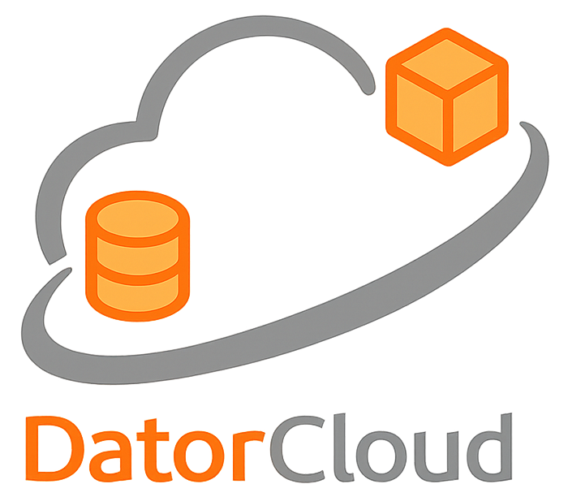

<p align="center">
  
</p>

<p align="center">
  <em>Lightweight, self-hosted framework for managing, querying, and sharing multimodal research data.</em>
</p>

<p align="center">
  <a href="docs/01_overview/overview.md">Overview</a> ·
  <a href="docs/02_installation/installing_core_data_platform.md">Installation</a> ·
  <a href="docs/03_components/architecture.md">Architecture</a> ·
  <a href="docs/04_user_guide/quickstart.md">Quickstart</a> ·
  <a href="docs/04_user_guide/tutorial_4dor.md">4dor Tutorial</a>
</p>

---

**DatorCloud** is a Python framework developed at **Balgrist University Hospital**
and the **OR-X Translational Center for Surgery**. It pairs **DuckDB** for fast
SQL-style analytics with **MinIO** for S3-compatible object storage, exposing
five single-responsibility components, a high-level orchestrator, a CLI, and a
ready-to-run Dagster workspace.

## Key features

- **Multimodal data management** — organize images, video, sensor streams, and
  clinical records in a structured, browsable framework.
- **Unified dataset catalog** — explore datasets by project, researcher, or
  experimental context.
- **Composable, testable architecture** — five components, dependency-injected,
  with a 30-test suite that runs entirely against in-memory fakes.
- **Three matched surfaces** — Python orchestrator, `datorcloud` CLI, and
  Dagster assets all hit the same pipeline.
- **`.env`-driven configuration** — no credentials are hard-coded; every
  component validates that real values were supplied.

## Installation

From source (recommended during development):

```bash
pip install -e ".[dagster,test]"
```

This installs the `datorcloud` Python package **and** the `datorcloud` CLI in
editable mode.

## Configuration

Copy the template and fill in your MinIO credentials and storage paths:

```bash
cp .env.example .env
```

Required variables (the components raise a clear `ValueError` when these are
missing):

| Variable               | Purpose                                  |
| ---------------------- | ---------------------------------------- |
| `S3_ENDPOINT`          | MinIO host:port (no scheme).             |
| `S3_ACCESS_KEY`        | MinIO access key.                        |
| `S3_SECRET_KEY`        | MinIO secret key.                        |
| `DATA_LAKE_PATH`       | Host path used for raw datasets.         |
| `RETRIEVED_DATA_PATH`  | Host path for files written by `retrieve`. |

## Usage

### Orchestrated (recommended)

`DatorCloudOrchestrator.from_env()` loads `.env` and wires every component for
you. Pass keyword overrides for anything you want to change.

```python
from datorcloud.core import DatorCloudOrchestrator

orchestrator = DatorCloudOrchestrator.from_env(
    data_bucket="orx-datalake",
    metadata_bucket="orx-metadata",
)

orchestrator.upload_datasets({"my-dataset": "./dataspaces/data_lake/my-dataset"})
orchestrator.generate_and_upload_metadata(
    dataset_dirs={"my-dataset": "./dataspaces/data_lake/my-dataset"},
    output_file="./dataspaces/data_lake/metadata.csv",
    object_name="metadata.csv",
)

results = orchestrator.query_metadata(filters={"camera_id": "camera01"}, limit=10)
```

### Individual components

Each component is also usable on its own. Credentials are required arguments;
loading them from `.env` keeps secrets out of the source tree.

```python
import os
from dotenv import load_dotenv

from datorcloud import (
    MinioObjectComponent,
    MetadataGeneratorComponent,
    MetadataStorageComponent,
)

load_dotenv()

minio = MinioObjectComponent(
    endpoint=os.environ.get("S3_ENDPOINT", "minio:9090"),
    access_key=os.environ["S3_ACCESS_KEY"],
    secret_key=os.environ["S3_SECRET_KEY"],
)

minio.upload_directory(
    local_directory="./dataspaces/data_lake/my-dataset",
    bucket_name="orx-datalake",
    prefix="my-dataset",
)

generator = MetadataGeneratorComponent()
storage = MetadataStorageComponent(minio_component=minio, metadata_bucket="orx-metadata")
storage.create_metadata_and_store(
    metadata_generator_component=generator,
    dataset_dirs={"my-dataset": "./dataspaces/data_lake/my-dataset"},
    local_file_path="./dataspaces/data_lake/metadata.csv",
    object_name="metadata.csv",
)
```

### Dagster

`DatorCloudResource` reads credentials and storage paths from `.env` via
Pydantic `default_factory`, so the resource works out of the box when `.env`
is loaded.

```python
from dagster import AssetSelection, Definitions, define_asset_job
from datorcloud.dagster import DatorCloudResource, component_assets

resource = DatorCloudResource(
    data_bucket="orx-datalake",
    metadata_bucket="orx-metadata",
)

datorcloud_job = define_asset_job(
    name="datorcloud_workflow_job",
    selection=AssetSelection.assets(*component_assets),
)

defs = Definitions(
    assets=component_assets,
    jobs=[datorcloud_job],
    resources={"datorcloud": resource},
)
```

### CLI

```bash
datorcloud upload   --dataset 4dor-dataset=./dataspaces/data_lake/4dor-dataset
datorcloud metadata --dataset 4dor-dataset=./dataspaces/data_lake/4dor-dataset
datorcloud query    --filter camera_id=camera01 --limit 10
datorcloud retrieve --dataset 4dor-dataset --filter camera_id=camera01 --max-files 5
```

The four subcommands map 1:1 to the orchestrator methods and to the four
Dagster assets:

1. `upload_datasets` — upload datasets to MinIO
2. `generate_metadata` — extract per-file metadata and persist it
3. `query_metadata` — filter the metadata catalog
4. `retrieve_objects` — download every object matched by a query

See `examples/` for runnable end-to-end scripts and
[`docs/04_user_guide/tutorial_4dor.md`](docs/04_user_guide/tutorial_4dor.md)
for a full walkthrough on the bundled multi-camera surgical dataset.

## Project layout

```
datorcloud/                  Python package
  components/                  Five single-responsibility components
  core/                        DatorCloudOrchestrator (+ from_env factory)
  dagster/                     ConfigurableResource + @asset definitions
  cli.py                       `datorcloud` command entry point
tests/                       pytest suite (30 tests, in-memory fakes)
examples/                    Runnable scripts (basic, components, dagster)
docs/                        MkDocs site
build/                       Dockerfiles for the Compose stack
dataspaces/                  Project storage skeleton (data_lake, ...)
docker-compose.yml           MinIO + DuckDB + Dagster + python-runner + cli
```

## Testing

```bash
pip install -e ".[test]"
pytest -q
```

You should see `30 passed`. The Dagster materialization test auto-skips when
`dagster` is not installed.

## License

BSD 3-Clause — see [LICENSE](LICENSE).
