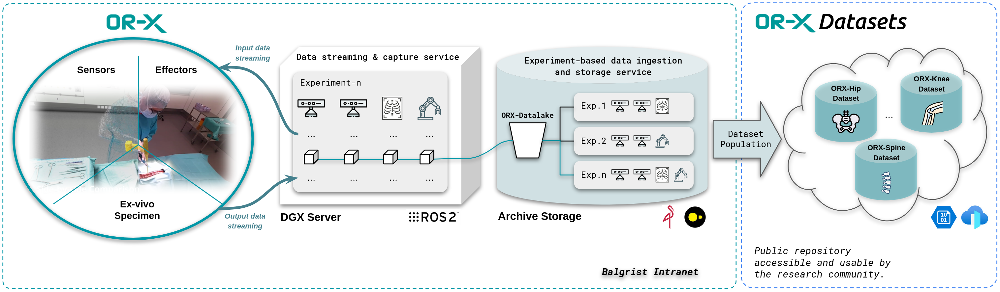

# ORX-SurgDataHub: A Surgical Data Science Platform for Managing and Populate Multimodal Datasets

**ORX-SurgDataHub** is a surgical data science platform designed to manage and populate multimodal datasets from surgical experiments. It integrates data from various sensors and effectors (surgeons and researchers) in ex-vivo (outside of a living body) surgical setups, capturing both input and output data through a ROS2-based data streaming system. The ORX-SurgDataHub core module, handles data ingestion, storage, and database operations, manages ETL workflows, catalogs experiments, and populates datasets to support research needs. This data is then organized by experiment and processed into specific datasets (e.g., hip, knee, spine) accessible to the research community through a public repository. This setup aims to support scientific research and improve data accessibility and reproducibility in surgical science.

### Key Components:

+ **ORX-Experiments:** Stores collected data and execution pipelines from various surgical experiments.
+ **ORX-Datasets:** Manages and centralizes surgical datasets, providing secure access for researchers.

### Data Model:
+ **Layer 1 - Experiment Card:** Contains essential metadata for each surgical experiment.
+ **Layer 2 - File Objects:** Stores metadata on files and relationships between devices and data files.
+ **Layer 3 - Semantic Layer:** Applies an ontology to establish contextual relationships for experiments’ workflow.
+ **Layer 4 - Dataset Composition:** Supports selection and composition of datasets based on experimental data.

### Core Operations:
+ **Data Extraction and Ingestion:** Experiment-based data objects are extracted and stored in the ORX-Datalake using MinIO, ensuring scalable and robust data management.
+ **Remote Querying and Downloading:** DuckDB enables researchers to perform remote queries and download specific experiment-based data objects, supporting efficient data retrieval.
+ **Dataset Selection and Composition:** OR-X researchers can select experiments and data objects to compile and populate relevant datasets for surgical studies.

### User Types:
+ **Public Researchers:** Academic users with access to publicly available datasets.
+ **Internal Researchers:** ORX and Balgrist researchers with access to experiment-based data for research.
+ **Commercial Partners:** ORX customers with exclusive access to their experiment-based data.