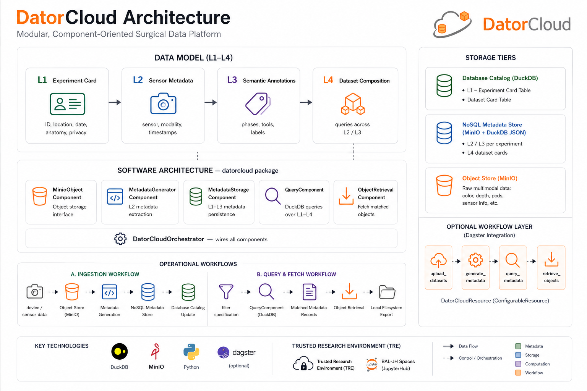

# DatorCloud Framework

**DatorCloud** is a lightweight, self-hosted cloud framework developed at
**Balgrist University Hospital** and the **OR-X Translational Center for
Surgery** to simplify the management, analysis, and sharing of multimodal
research data. Built on **DuckDB** and **MinIO**, it enables fast, SQL-like
queries on S3-compatible storage without the need for complex
infrastructure.

Designed for secure and collaborative use via **JupyterHub**, DatorCloud
enhances and complements **BAL-JH Spaces** by adding powerful features for
organizing, querying, and publishing rich, multimodal datasets such as
images, video, sensor data, and clinical data. Its modular and scalable
design makes it suitable for research groups, labs, and institutions of any
size.

> **BAL-JH Spaces** is a secure, cloud-based research environment tailored
> for Balgrist researchers, built on JupyterHub and fully integrated with
> institutional infrastructure. It provides the foundational computing
> environment for many AI/ML research workflows at Balgrist.

## Key features of DatorCloud

- **Multimodal Data Management** — Organize and access diverse datasets
  including images, video, sensor data, and clinical data in a web-based
  framework.
- **Unified Dataset Catalog** — Govern and browse experiment data and
  datasets by institution, unit, researcher, or experimental context.
- **Dataset Composition & Publishing** — Build custom datasets with SQL-like
  queries on object storage and manage publication with integrated access
  controls.
- **Structured, Traceable Access** — Perform complex queries and retrieval
  across datasets and the object store using DuckDB and MinIO CLIs, enabling
  deep analysis with fewer data duplications.

## Shared capabilities with BAL-JH Spaces

- **Web-Based Access & Analysis** — Work directly in the browser via
  JupyterHub without local setup.
- **Pre-Configured AI/ML Environments** — Launch Docker-based workspaces
  with ready-to-use tools and libraries.
- **On-Demand Compute Access** — Leverage local and remote GPU resources for
  heavy data processing and model training.
- **Collaborative Workspaces** — Share code, results, and environments to
  support reproducible, team-based research.

## Where to go next

- [Installation](../02_installation/installing_core_data_platform.md) —
  deploy the DuckDB + MinIO stack with Docker Compose.
- [Component Architecture](../03_components/architecture.md) — the four-layer
  data model, components, and orchestrator.
- [Quickstart](../04_user_guide/quickstart.md) — fresh clone to a working
  pipeline in five minutes.
- [Contributing](../05_contributing/contributing.md) — extend the framework
  with new components.
